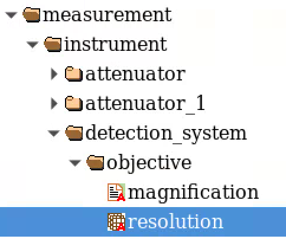
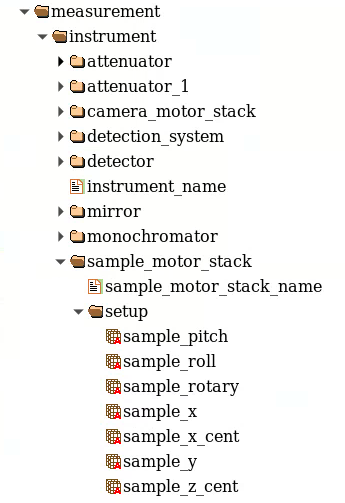
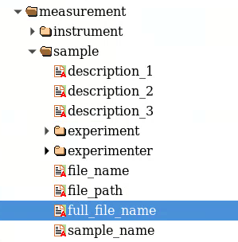
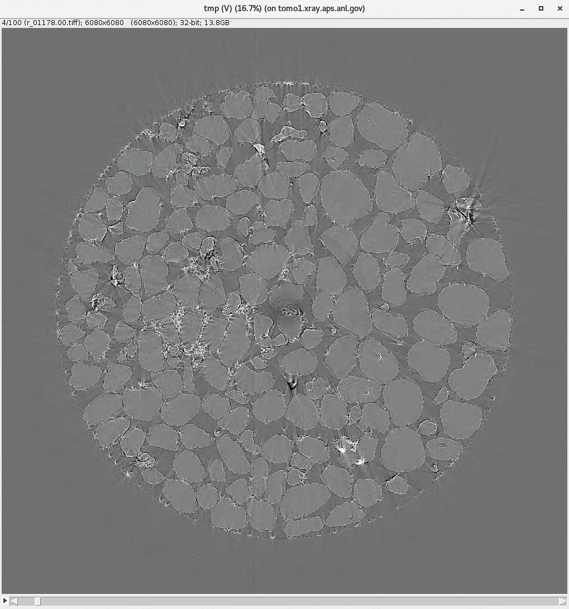
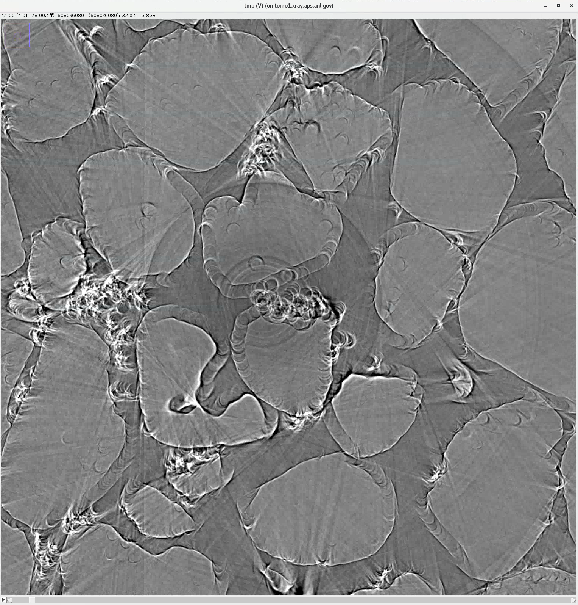
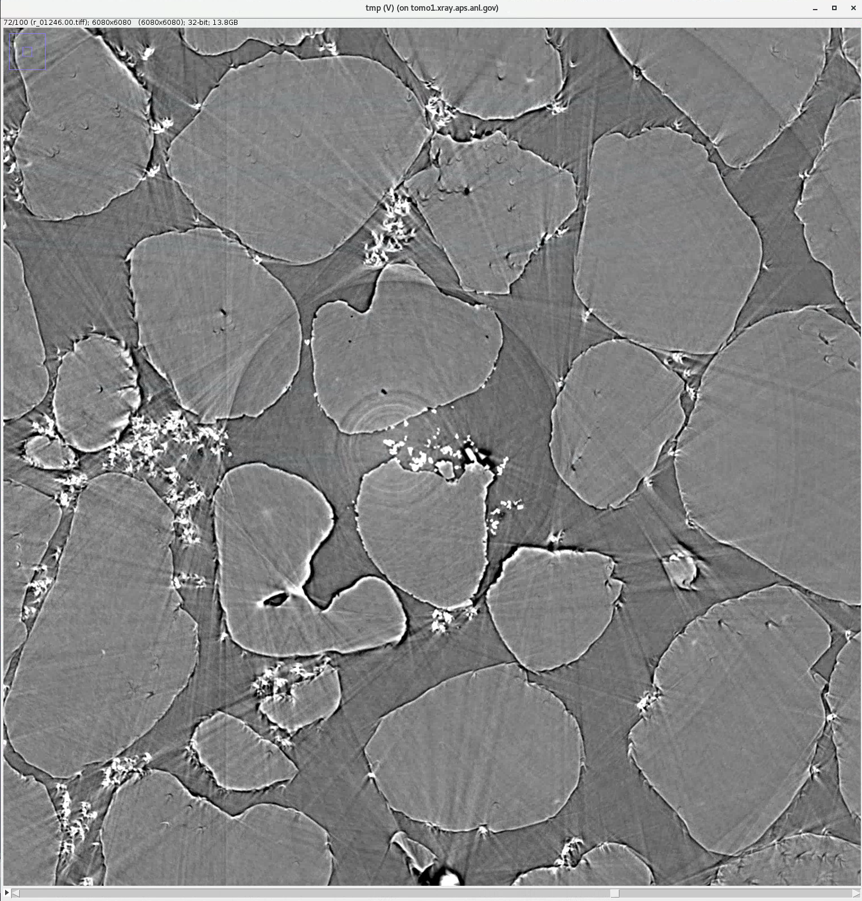
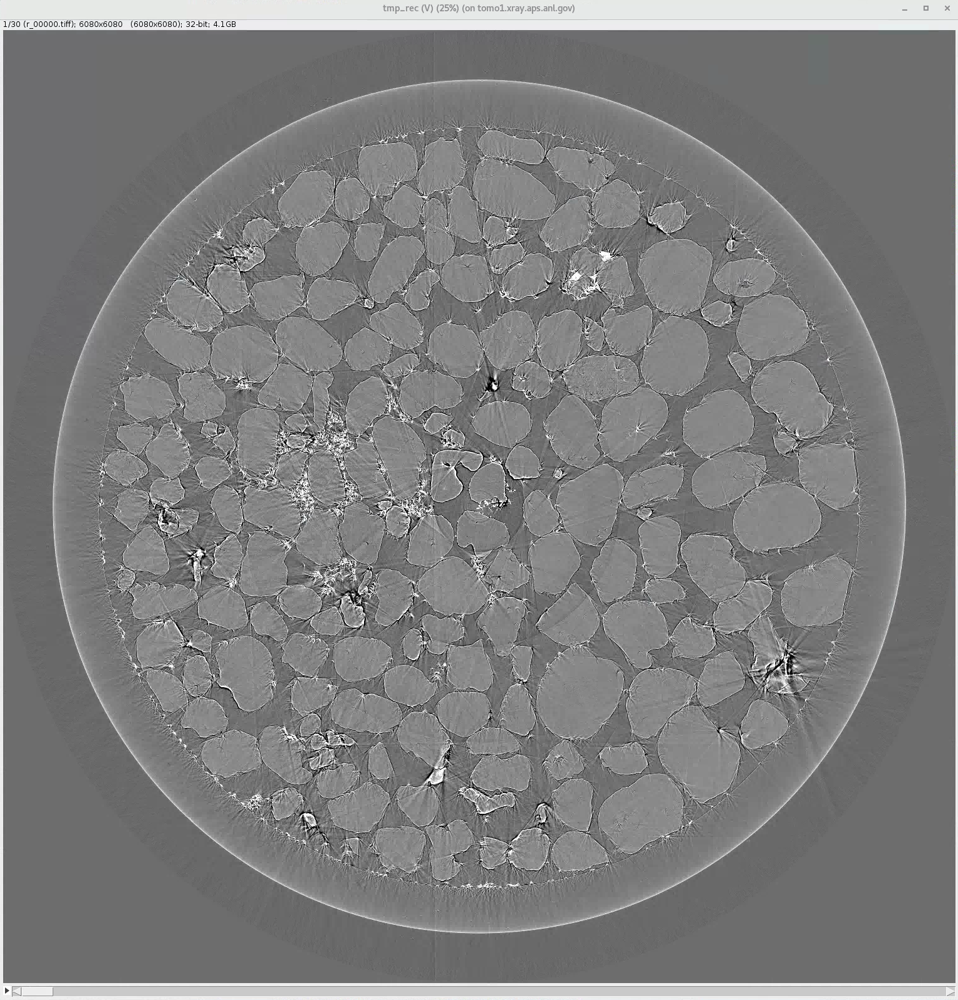
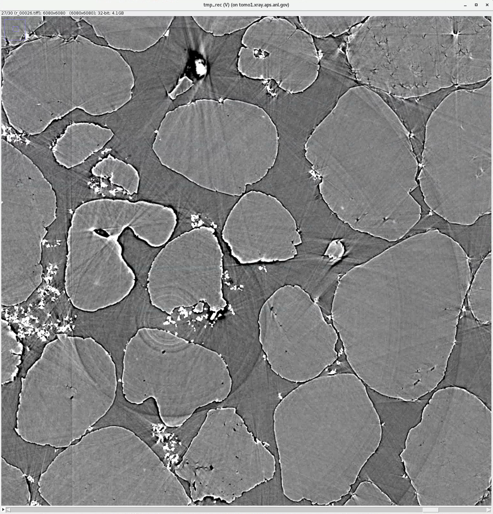

=====
Usage
=====
 
1. Verify the dataset is valid
==============================

Tile needs the following experiment meta data to automatically sort the mosaic tiles by location and set the initial overlapping conditions:

#. X-Y location of each tile in mm
#. the projection image pixel size in microns
#. the tile data set full file name

At the APS beamline `2 BM <https://docs2bm.readthedocs.io/en/latest/>`_, these meta data are automatically stored at data collection time in an hdf file compliant with `dxfile <https://dxfile.readthedocs.io/en/latest/index.html>`_ following this layout:

#. sample_x  (mm)         = '/measurement/instrument/sample_motor_stack/setup/x'
#. sample_y  (mm)         = '/measurement/instrument/sample_motor_stack/setup/y'
#. resolution (micron)    = '/measurement/instrument/detection_system/objective/resolution'
#. full_file_name         = '/measurement/sample/file/full_name'

If these parameters are stored somewhere else in your hdf file, you can set their locations at runtime using the 
--sample-x, --sample-y, --resolution --full-file-name options. 

#. --sample-x '/your_hdf_path/to_sample_x_in_mm'
#. --sample-y '/your_hdf_path/to_sample_y_in_mm'
#. --resolution '/your_hdf_path/to_image_resolution_in_micron'
#. --full-file-name '/your_hdf_path/to_the_full_file_name'

By default, these are set to:

#. --sample-x '/measurement/instrument/sample_motor_stack/setup/x'
#. --sample-y '/measurement/instrument/sample_motor_stack/setup/y'
#. --resolution '/measurement/instrument/detection_system/objective/resolution'
#. --full-file-name '/measurement/sample/file/full_name'

to meet the `dxfile <https://dxfile.readthedocs.io/en/latest/source/demo/doc.areadetector.html#xml>`_ definitions for 
beamlines `2 BM <https://docs2bm.readthedocs.io/en/latest/>`_ , `7 BM <https://docs7bm.readthedocs.io/en/latest/>`_ 
and `32 ID <https://docs32id.readthedocs.io/en/latest/>`_.

Once the above are confirmed, you can validate the mosaic data set with:
::

    (tile)$ tile show --folder-name /data/2021-12/Duchkov/mosaic/
    2022-02-16 11:33:38,485 - Started tile
    2022-02-16 11:33:38,485 - Saving log at /home/beams/TOMO/logs/tile_2022-02-16_11_33_38.log
    2022-02-16 11:33:38,485 - checking tile files ...
    2022-02-16 11:33:38,487 - Checking directory: /data/2021-12/Duchkov/mosaic for a tile scan
    2022-02-16 11:33:38,864 - tile file sorted
    2022-02-16 11:33:38,865 - x0y0: x = -0.000100; y = 28.000000, file name = /data/2021-12/Duchkov/mosaic/mosaic_2073.h5, original file name = /local/data/2021-12/Duchkov/mosaic_2073.h5
    2022-02-16 11:33:38,865 - x1y0: x = 0.849900; y = 28.000000, file name = /data/2021-12/Duchkov/mosaic/mosaic_2074.h5, original file name = /local/data/2021-12/Duchkov/mosaic_2074.h5
    2022-02-16 11:33:38,865 - x2y0: x = 1.699900; y = 28.000000, file name = /data/2021-12/Duchkov/mosaic/mosaic_2075.h5, original file name = /local/data/2021-12/Duchkov/mosaic_2075.h5
    2022-02-16 11:33:38,865 - x3y0: x = 2.549900; y = 28.000000, file name = /data/2021-12/Duchkov/mosaic/mosaic_2076.h5, original file name = /local/data/2021-12/Duchkov/mosaic_2076.h5
    2022-02-16 11:33:38,865 - x4y0: x = 3.399900; y = 28.000000, file name = /data/2021-12/Duchkov/mosaic/mosaic_2077.h5, original file name = /local/data/2021-12/Duchkov/mosaic_2077.h5
    2022-02-16 11:33:39,035 - image   size (x, y) in pixels: (2448, 2048)
    2022-02-16 11:33:39,035 - tile shift (x, y) in pixels: (2428, 0)
    2022-02-16 11:33:39,035 - tile overlap (x, y) in pixels: (20, 2048)
    2022-02-16 11:33:39,040 - tile file name grid:
                                                 y_0                                          y_1                                          y_2                                          y_3                                          y_4
    x_0  /data/2021-12/Duchkov/mosaic/mosaic_2073.h5  /data/2021-12/Duchkov/mosaic/mosaic_2074.h5  /data/2021-12/Duchkov/mosaic/mosaic_2075.h5  /data/2021-12/Duchkov/mosaic/mosaic_2076.h5  /data/2021-12/Duchkov/mosaic/mosaic_2077.h5

2. Find rotation center
=======================

The first step is to find the location of the rotation axis of the stitched data set. The command below, **tile center**, will stitch the projections horizontally using, as first approximation, the nominal overlap distance stored in the hdf file and will then generate a stack of reconstructed images containing the same slice (default slice is vertically in the center, adjustable with --nsino) with location of the rotation axis +/- 50 pixel around the middle of the horizontal size of the detector with steps of 0.25 pixels. The stack of reconstructed slice will be done using tomocupy.

::

    (tile)$ tile center --nproj-per-chunk 64 --folder-name /data/2021-12/Duchkov/mosaic/ --nsino-per-chunk 2 --binning 2 --center-search-width 50 --center-search-step 0.25 --recon-engine tomocupy
    2022-02-16 15:29:38,906 - Started tile
    2022-02-16 15:29:38,906 - Saving log at /home/beams/TOMO/logs/tile_2022-02-16_15_29_38.log
    2022-02-16 15:29:38,906 - Run find rotation axis location
    2022-02-16 15:29:38,906 - checking tile files ...
    2022-02-16 15:29:38,906 - Checking directory: /data/2021-12/Duchkov/mosaic for a tile scan
    2022-02-16 15:29:39,286 - tile file sorted
    2022-02-16 15:29:39,287 - x0y0: x = -0.000100; y = 28.000000, file name = /data/2021-12/Duchkov/mosaic/mosaic_2073.h5, original file name = /local/data/2021-12/Duchkov/mosaic_2073.h5
    2022-02-16 15:29:39,287 - x1y0: x = 0.849900; y = 28.000000, file name = /data/2021-12/Duchkov/mosaic/mosaic_2074.h5, original file name = /local/data/2021-12/Duchkov/mosaic_2074.h5
    2022-02-16 15:29:39,287 - x2y0: x = 1.699900; y = 28.000000, file name = /data/2021-12/Duchkov/mosaic/mosaic_2075.h5, original file name = /local/data/2021-12/Duchkov/mosaic_2075.h5
    2022-02-16 15:29:39,287 - x3y0: x = 2.549900; y = 28.000000, file name = /data/2021-12/Duchkov/mosaic/mosaic_2076.h5, original file name = /local/data/2021-12/Duchkov/mosaic_2076.h5
    2022-02-16 15:29:39,287 - x4y0: x = 3.399900; y = 28.000000, file name = /data/2021-12/Duchkov/mosaic/mosaic_2077.h5, original file name = /local/data/2021-12/Duchkov/mosaic_2077.h5
    2022-02-16 15:29:39,456 - image   size (x, y) in pixels: (2448, 2048)
    2022-02-16 15:29:39,456 - stitch shift (x, y) in pixels: (2428, 0)
    2022-02-16 15:29:39,456 - tile overlap (x, y) in pixels: (20, 2048)
    2022-02-16 15:29:42,657 - Created a temporary hdf file: /data/2021-12/Duchkov/mosaic/tile/tmp.h5
    2022-02-16 15:29:42,658 - Running: tomocupy recon --file-type double_fov --binning 2 --reconstruction-type try --file-name /data/2021-12/Duchkov/mosaic/tile/tmp.h5 --center-search-width 50.0 --rotation-axis-auto manual --rotation-axis 1224.0   --center-search-step 0.25
    2022-02-16 15:29:44,427 - Try rotation center reconstruction for slice 0
    queue size 000 |  |████████████████████████████████████████| 100.0% 
    2022-02-16 15:30:00,651 - Output: /data/2021-12/Duchkov/mosaic/tile_recgpu/try_center/tmp/r_
    Reconstruction time 23.8s
    2022-02-16 15:30:08,307 - Please open the stack of images from /data/2021-12/Duchkov/mosaic/tile_recgpu/try_center/tmp/recon* and select the rotation center

Use `Fiji ImageJ <https://imagej.net/software/fiji/>`_  to load the reconstructed slice stack with File/Import/Image Sequence:

Zoom into the center region of the image and move the slider: 

until the center of the image is sharp and free of artifacts:

Please focus only on the center of the image for now. Once done, on the top left corner of the image you will see the corresponding rotation axis location, 1246 in this case. Store this for the next step.

3. Tile Shift
=============

**tile center** used the nominal tile overlap distance stored in the hdf file. In this step, **tile shift** will fine tune each tile location. This process will keep the center tile fixed and slide one at the time each of the tiles moving away from the center tile.

The optimal tile locations will be determined looking at reconstructed slices or at projections generated by sliding the overlap region along a preset --shift-search-width in steps of --shift-search-step pixels. The command below will shift the tiles, one at the time, by +/- 30 pixel from the nominal location stored in the hdf file at data collection time, in step of 2 pixels.

::

    (tile)$ tile shift --folder-name /data/2021-12/Duchkov/mosaic/ --shift-search-width 30 --shift-search-step 2 --recon-engine tomocupy
    2022-02-16 17:30:08,246 - Started tile
    2022-02-16 17:30:08,247 - Saving log at /home/beams/TOMO/logs/tile_2022-02-16_17_30_08.log
    2022-02-16 17:30:08,247 - Run manual shift
    2022-02-16 17:30:08,247 - checking tile files ...
    2022-02-16 17:30:08,247 - Checking directory: /data/2021-12/Duchkov/mosaic for a tile scan
    2022-02-16 17:30:08,626 - tile file sorted
    2022-02-16 17:30:08,626 - x0y0: x = -0.000100; y = 28.000000, file name = /data/2021-12/Duchkov/mosaic/mosaic_2073.h5, original file name = /local/data/2021-12/Duchkov/mosaic_2073.h5
    2022-02-16 17:30:08,626 - x1y0: x = 0.849900; y = 28.000000, file name = /data/2021-12/Duchkov/mosaic/mosaic_2074.h5, original file name = /local/data/2021-12/Duchkov/mosaic_2074.h5
    2022-02-16 17:30:08,626 - x2y0: x = 1.699900; y = 28.000000, file name = /data/2021-12/Duchkov/mosaic/mosaic_2075.h5, original file name = /local/data/2021-12/Duchkov/mosaic_2075.h5
    2022-02-16 17:30:08,626 - x3y0: x = 2.549900; y = 28.000000, file name = /data/2021-12/Duchkov/mosaic/mosaic_2076.h5, original file name = /local/data/2021-12/Duchkov/mosaic_2076.h5
    2022-02-16 17:30:08,626 - x4y0: x = 3.399900; y = 28.000000, file name = /data/2021-12/Duchkov/mosaic/mosaic_2077.h5, original file name = /local/data/2021-12/Duchkov/mosaic_2077.h5
    2022-02-16 17:30:08,792 - image   size (x, y) in pixels: (2448, 2048)
    2022-02-16 17:30:08,792 - stitch shift (x, y) in pixels: (2428, 0)
    2022-02-16 17:30:08,792 - tile overlap (x, y) in pixels: (20, 2048)
    Please enter rotation center (1224.0): 1246
    2022-02-16 17:32:09,507 - Full reconstruction
    queue size 000 |  |████████████████████████████████████████| 100.0% 
    2022-02-16 17:32:31,184 - Output: /data/2021-12/Duchkov/mosaic/tile_recgpu/tmp_rec/r
    Reconstruction time 26.3s
    Please open the stack of images from reconstructions /data/2021-12/Duchkov/mosaic/tile_recgpu/tmp_rec/recon* or stitched projections /data/2021-12/Duchkov/mosaic/tile_recgpu/tmp_proj/p*, and select the file id to shift tile 1
    Please enter id for tile 1: 

Use `Fiji ImageJ <https://imagej.net/software/fiji/>`_  to load the reconstructed slice or projection stack with File/Import/Image Sequence:

Zoom into the region of the image separating the center tile from the first tile and move the slider: 

until the image in the second tile is sharp and free of artifacts:

On the top left corner of the image you will see the corresponding tile overlap index, 26 in this case, and enter it at:

::

    Please enter id for tile 1: 26
    2022-02-16 18:14:22,816 - Current shifts: [   0 2450 2428 2428 2428]

**tile shift** will now repeat the same keeping the center tile and first tile fixed and slide the next tile only.

::

    Please enter id for tile 1: 26
    2022-02-16 18:14:22,816 - Current shifts: [   0 2450 2428 2428 2428]
    2022-02-16 18:16:02,917 - Full reconstruction
    queue size 000 |  |████████████████████████████████████████| 100.0% 
    2022-02-16 18:16:26,167 - Output: /data/2021-12/Duchkov/mosaic/tile_recgpu/tmp_rec/r
    Reconstruction time 28.1s
    Please open the stack of images from reconstructions /data/2021-12/Duchkov/mosaic/tile_recgpu/tmp_rec/recon* or stitched projections /data/2021-12/Duchkov/mosaic/tile_recgpu/tmp_proj/p*, and select the file id to shift tile 2

Repeat the `Fiji ImageJ <https://imagej.net/software/fiji/>`_ image inspection looking at the next set of tile overlap region, and, as before, enter the corresponding tile overlap index and move to the next tile.

::

    Please enter id for tile 2: 26
    2022-02-16 18:20:36,145 - Current shifts: [   0 2450 2450 2428 2428]
    2022-02-16 18:22:16,112 - Full reconstruction
    queue size 000 |  |████████████████████████████████████████| 100.0% 
    2022-02-16 18:22:38,549 - Output: /data/2021-12/Duchkov/mosaic/tile_recgpu/tmp_rec/r
    Reconstruction time 27.1s
    Please open the stack of images from reconstructions /data/2021-12/Duchkov/mosaic/tile_recgpu/tmp_rec/recon* or stitched projections /data/2021-12/Duchkov/mosaic/tile_recgpu/tmp_proj/p*, and select the file id to shift tile 3
    Please enter id for tile 3: 27
    2022-02-16 18:23:27,249 - Current shifts: [   0 2450 2450 2452 2428]
    2022-02-16 18:25:07,526 - Full reconstruction
    queue size 000 |  |████████████████████████████████████████| 100.0% 
    2022-02-16 18:25:29,959 - Output: /data/2021-12/Duchkov/mosaic/tile_recgpu/tmp_rec/r
    Reconstruction time 27.3s
    Please open the stack of images from reconstructions /data/2021-12/Duchkov/mosaic/tile_recgpu/tmp_rec/recon* or stitched projections /data/2021-12/Duchkov/mosaic/tile_recgpu/tmp_proj/p*, and select the file id to shift tile 4
    Please enter id for tile 4: 28
    2022-02-16 18:25:53,832 - Current shifts: [   0 2450 2450 2452 2454]
    2022-02-16 18:25:53,833 - Center 1246
    2022-02-16 18:25:53,833 - Relative shifts [0, 2450, 2450, 2452, 2454]

4. Tile Stitch 
==============

At the end of **tile shift** step, we obtain a list of shifts [0, 2450, 2450, 2452, 2454] that we can use for the final tile stiching. **tile stitch** will generate a single hdf file merging all mosaic tiles with the correct overlap.

::

    (tile)$ tile stitch --folder-name /data/2021-12/Duchkov/mosaic --nproj-per-chunk 128 --x-shifts "[0, 2450, 2450, 2452, 2454]" 
    2022-02-16 18:30:06,770 - Started tile
    2022-02-16 18:30:06,770 - Saving log at /home/beams/TOMO/logs/tile_2022-02-16_18_30_06.log
    2022-02-16 18:30:06,770 - Run stitching
    2022-02-16 18:30:06,770 - checking tile files ...
    2022-02-16 18:30:06,770 - Checking directory: /data/2021-12/Duchkov/mosaic for a tile scan
    2022-02-16 18:30:07,146 - tile file sorted
    2022-02-16 18:30:07,146 - x0y0: x = -0.000100; y = 28.000000, file name = /data/2021-12/Duchkov/mosaic/mosaic_2073.h5, original file name = /local/data/2021-12/Duchkov/mosaic_2073.h5
    2022-02-16 18:30:07,146 - x1y0: x = 0.849900; y = 28.000000, file name = /data/2021-12/Duchkov/mosaic/mosaic_2074.h5, original file name = /local/data/2021-12/Duchkov/mosaic_2074.h5
    2022-02-16 18:30:07,146 - x2y0: x = 1.699900; y = 28.000000, file name = /data/2021-12/Duchkov/mosaic/mosaic_2075.h5, original file name = /local/data/2021-12/Duchkov/mosaic_2075.h5
    2022-02-16 18:30:07,146 - x3y0: x = 2.549900; y = 28.000000, file name = /data/2021-12/Duchkov/mosaic/mosaic_2076.h5, original file name = /local/data/2021-12/Duchkov/mosaic_2076.h5
    2022-02-16 18:30:07,146 - x4y0: x = 3.399900; y = 28.000000, file name = /data/2021-12/Duchkov/mosaic/mosaic_2077.h5, original file name = /local/data/2021-12/Duchkov/mosaic_2077.h5
    2022-02-16 18:30:07,321 - Relative shifts [   0 2450 2450 2452 2454]
    2022-02-16 18:30:07,323 - Stitching projections 0 - 128
    2022-02-16 18:30:20,461 - Stitching projections 128 - 256
    2022-02-16 18:30:32,099 - Stitching projections 256 - 384
    2022-02-16 18:30:50,475 - Stitching projections 384 - 512
    2022-02-16 18:31:12,040 - Stitching projections 512 - 640
    2022-02-16 18:31:30,324 - Stitching projections 640 - 768
    2022-02-16 18:31:49,881 - Stitching projections 768 - 896
    2022-02-16 18:32:08,534 - Stitching projections 896 - 1024
    2022-02-16 18:32:26,784 - Stitching projections 1024 - 1152
    2022-02-16 18:32:47,320 - Stitching projections 1152 - 1280
    2022-02-16 18:33:04,260 - Stitching projections 1280 - 1408
    2022-02-16 18:33:23,326 - Stitching projections 1408 - 1536
    2022-02-16 18:33:41,526 - Stitching projections 1536 - 1664
    2022-02-16 18:34:00,341 - Stitching projections 1664 - 1792
    2022-02-16 18:34:18,362 - Stitching projections 1792 - 1920
    2022-02-16 18:34:37,191 - Stitching projections 1920 - 2048
    2022-02-16 18:34:55,829 - Stitching projections 2048 - 2176
    2022-02-16 18:35:15,554 - Stitching projections 2176 - 2304
    2022-02-16 18:35:33,733 - Stitching projections 2304 - 2432
    2022-02-16 18:35:58,429 - Stitching projections 2432 - 2560
    2022-02-16 18:36:16,669 - Stitching projections 2560 - 2688
    2022-02-16 18:36:37,403 - Stitching projections 2688 - 2816
    2022-02-16 18:37:01,131 - Stitching projections 2816 - 2944
    2022-02-16 18:37:21,374 - Stitching projections 2944 - 3072
    2022-02-16 18:37:40,137 - Stitching projections 3072 - 3200
    2022-02-16 18:37:55,265 - Stitching projections 3200 - 3328
    2022-02-16 18:38:13,574 - Stitching projections 3328 - 3456
    2022-02-16 18:38:35,979 - Stitching projections 3456 - 3584
    2022-02-16 18:38:57,068 - Stitching projections 3584 - 3712
    2022-02-16 18:39:16,547 - Stitching projections 3712 - 3840
    2022-02-16 18:39:40,333 - Stitching projections 3840 - 3968
    2022-02-16 18:40:01,126 - Stitching projections 3968 - 4096
    2022-02-16 18:40:23,886 - Stitching projections 4096 - 4224
    2022-02-16 18:40:44,862 - Stitching projections 4224 - 4352
    2022-02-16 18:41:08,228 - Stitching projections 4352 - 4480
    2022-02-16 18:41:30,260 - Stitching projections 4480 - 4608
    2022-02-16 18:41:52,968 - Stitching projections 4608 - 4736
    2022-02-16 18:42:14,439 - Stitching projections 4736 - 4864
    2022-02-16 18:42:36,661 - Stitching projections 4864 - 4992
    2022-02-16 18:42:58,154 - Stitching projections 4992 - 5120
    2022-02-16 18:43:21,760 - Stitching projections 5120 - 5248
    2022-02-16 18:43:43,310 - Stitching projections 5248 - 5376
    2022-02-16 18:44:04,637 - Stitching projections 5376 - 5504
    2022-02-16 18:44:22,942 - Stitching projections 5504 - 5632
    2022-02-16 18:44:45,562 - Stitching projections 5632 - 5760
    2022-02-16 18:45:03,388 - Stitching projections 5760 - 5888
    2022-02-16 18:45:23,980 - Stitching projections 5888 - 6000
    2022-02-16 18:55:02,606 - Output file /data/2021-12/Duchkov/mosaic/tile/tile.h5
    2022-02-16 19:03:41,109 - Reconstruct /data/2021-12/Duchkov/mosaic/tile/tile.h5 with tomocupy:
    2022-02-16 19:03:41,110 - tomocupy recon --file-name /data/2021-12/Duchkov/mosaic/tile/tile.h5 --rotation-axis 1246 --reconstruction-type full --file-type double_fov --remove-stripe-method fw --binning 0 --nsino-per-chunk 8 --rotation-axis-auto manual
    2022-02-16 19:03:41,110 - Reconstruct /data/2021-12/Duchkov/mosaic/tile/tile.h5 with tomopy:
    2022-02-16 19:03:41,110 - tomopy recon --file-name /data/2021-12/Duchkov/mosaic/tile/tile.h5 --rotation-axis 1246 --reconstruction-type full --file-type double_fov --remove-stripe-method fw --binning 0 --nsino-per-chunk 8 --rotation-axis-auto manual

5. Tile reconstruction 
======================

Once the stitching is completed the tomographic reconstruction can be done with `tomocupy <https://tomocupy.readthedocs.io/en/latest/>`_ or `tomopy <https://tomopy.readthedocs.io/en/latest/>`_/`tomopycli <https://tomopycli.readthedocs.io/en/latest/>`_:

with **tomocupy**
::
 
    (tile)$ tomocupy recon --file-name /data/2021-12/Duchkov/mosaic/tile/tile.h5 --rotation-axis 1246 --reconstruction-type full --file-type double_fov --remove-stripe-method fw --binning 0 --nsino-per-chunk 8 --rotation-axis-auto manual

with **tomopy**
::
 
    (tile)$ tomopy recon --file-name /data/2021-12/Duchkov/mosaic/tile/tile.h5 --rotation-axis 1246 --reconstruction-type full --file-type double_fov --remove-stripe-method fw --binning 0 --nsino-per-chunk 8 --rotation-axis-auto manual

For more options:
::

    (tile)$ tile -h
    (tile)$ tile stitch -h
    (tile)$ tile shift -h 
